*NOTE:* This file is a template that you can use to create the README for your project. The *TODO* comments below will highlight the information you should be sure to include.

# Bankmarketing Pipeline Creation

In this project I configure an automated ML experiment in Azure in order to choose the best model to predict the outcome of a bankmarketing campaign. The best model will be deployed and consumed. In addition, I create a pipeline consisting of the bankmarketing data and the previous AutoML model. This pipeline will be published and consumed as well.

## Architectural Diagram

1. Using Automated ML to determine the best model
2. Deploying the best model to deliver a trained model into production
3. Enabling application insights to detect anomalies and visualize performance
4. Consuming model endpoints in order to interact with the trained model
5. Creating and publishing a pipeline to combine different steps and make them publicly available, so external services can interact with the pipeline

## Key Steps
1. Automated ML Experiment: In this step I created an AutoML run in the Azure ML Studio and uploaded the bankmarketing dataset from local files as tabular data (screenshot registered_dataset). Next, I created a new experiment and a new compute cluster to train the classification model. After configuration the experiment is run. When the experiment is completed (screenshot best_model), the best model is given 
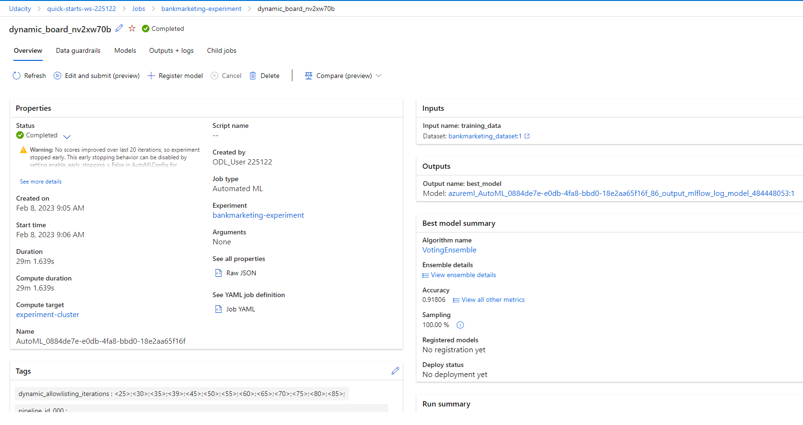

2. Deploy the best model: I deployed the best model in ML Studio with enabled authentication and using ACI.
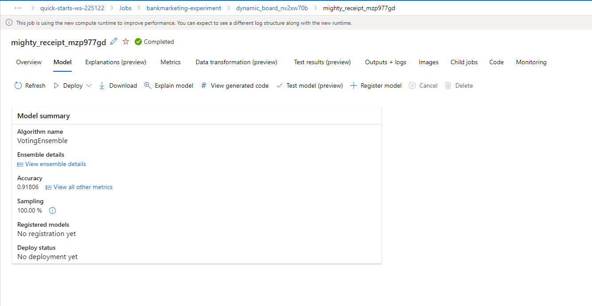

3. Enable Application Insights: For this step I used the Azure Python SDK. I modified the log.py script to enable application insights
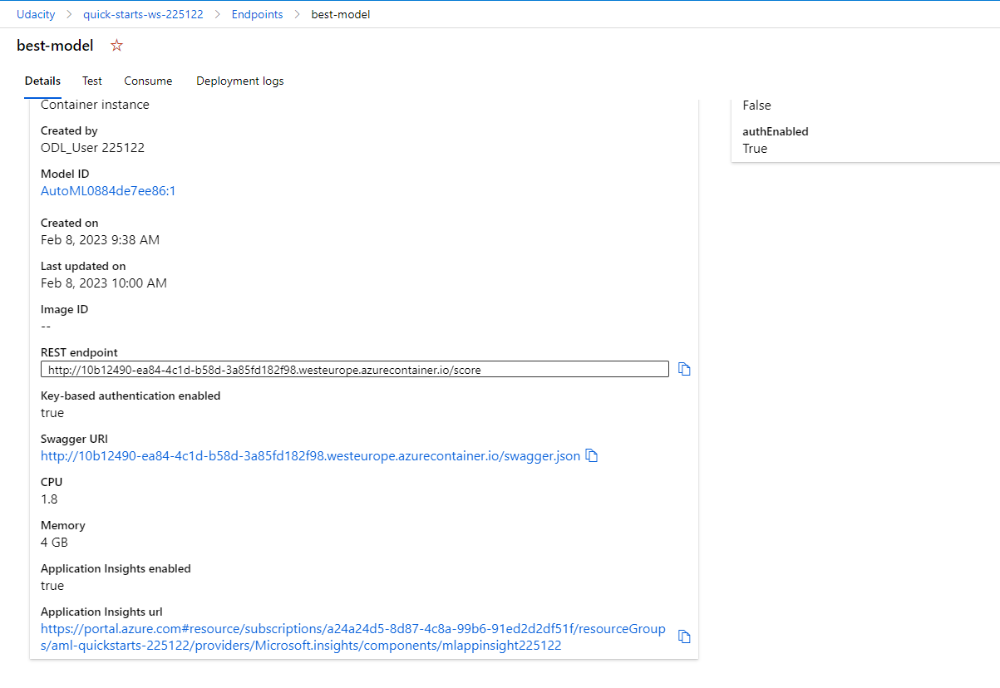
and run it in a terminal.
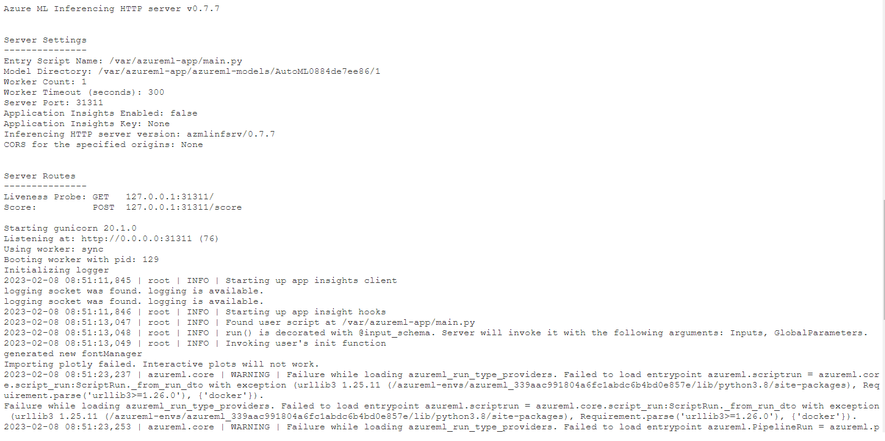
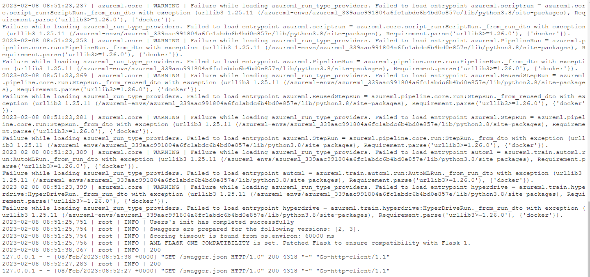

4. Swagger documentation: I downloaded the swagger.json file and run swagger.sh and serve.py in a terminal.

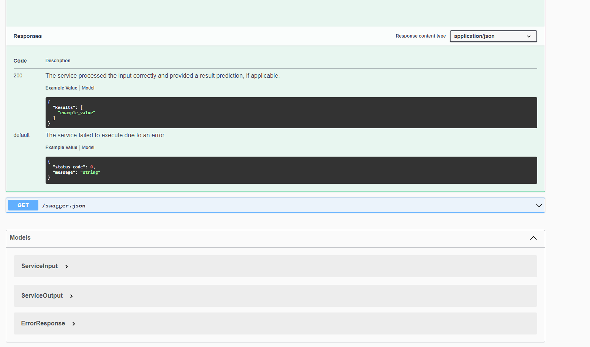

5. Consume model: I added the scoring_uri and the key to the endpoint.py script and executed it in the terminal.
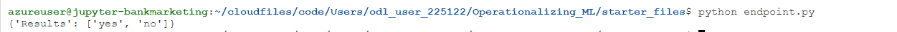

6. Create, Publish and Consume a Pipeline: After updating all variables, I executed the provided notebook. There a pipeline is created,
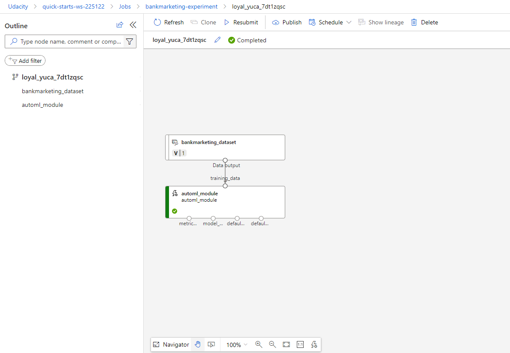
published and consumed.
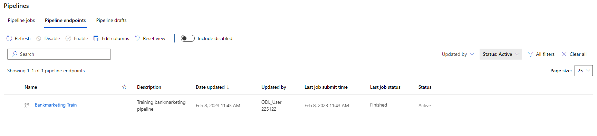
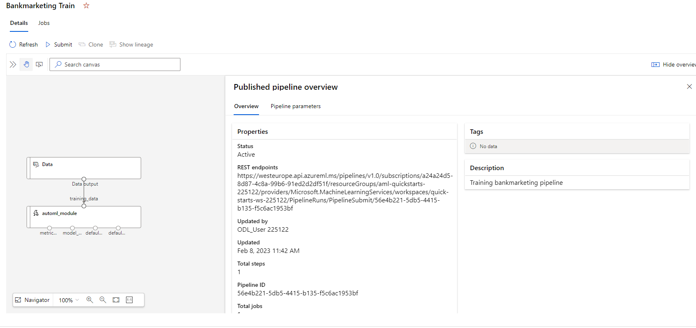
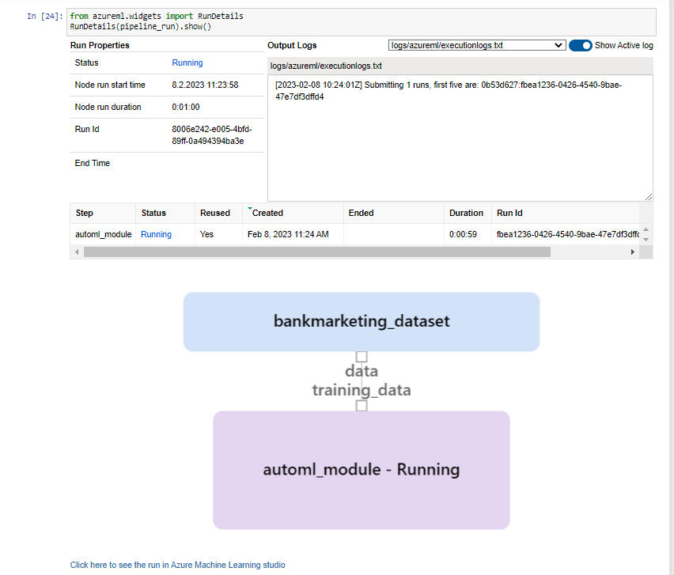
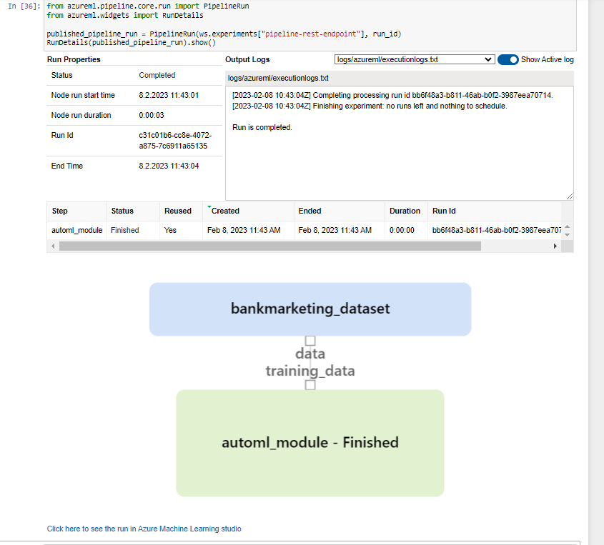
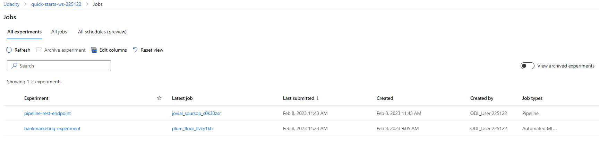
 

## Screen Recording
Link: https://youtu.be/ZuEhcZ15JaU

## Standout Suggestions
*TODO (Optional):* The python script 'endpoint.py' should be modified. The argument 'Inputs' is missing in the data dictionary. Without this argument we do not get the required results.
